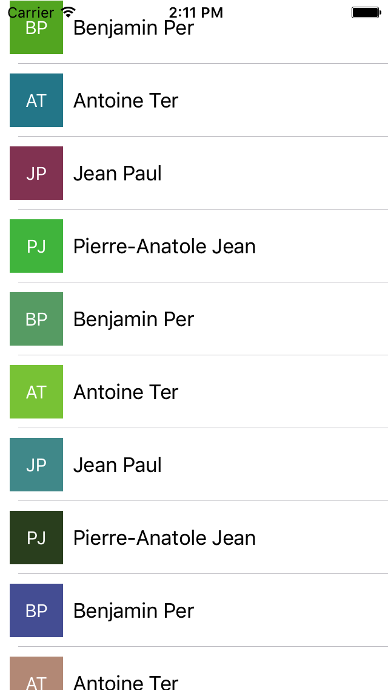
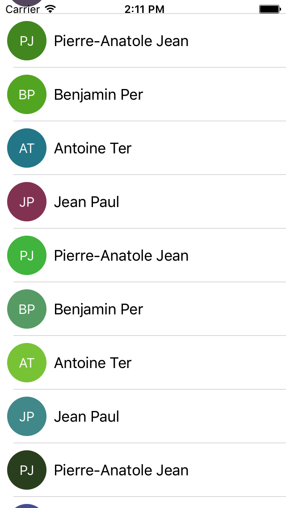

UIImageView + Letters
=====================

Inspired by https://github.com/bachonk/UIImageView-Letters

An easy, helpful UIImageView extension that generates letter initials as a placeholder for user profile images, with a randomized background color if needed




### Installation

##### CocoaPods

Add this spec to your podfile:

+ `use_frameworks!`
+ `pod 'Letters'`

Check out the [official guide](http://guides.cocoapods.org/using/index.html) for getting started with CocoaPods.

##### Manual

1. Drag the `UIImageView + Letters.swift` files into your project
2. Enjoy!

### Usage

##### Methods

Call the following methods on any `UIImageView` instance to set the image:

+ `func setImage(string: String?)`
+ `func setImage(string: String?, color: UIColor?)`
+ `func setImage(string: String?, color: UIColor?, circular: Bool)`
+ `func setImage(string: String?, color: UIColor?, circular: Bool, textAttributes: [String : Any]?)`

`string` is the string used to generate the initials. This should be a user's full name if available.

`color` is an optional parameter that sets the background color of the image. Pass in `nil` to have a color automatically generated for you.

`isCircular` is a boolean parameter that will automatically clip the image to a circle if enabled.

`textAttributes` is an NSDictionary that allows you to specify font, text color, shadow properties, etc., for the letters text, using the keys found in `NSAttributedString`.

If you want to keep the same color for a given name, you can use

+ `class func colorForName(name: String?) -> UIColor`

##### Example

```
userImageView?.setImage(string: "John DOE", color: nil, circular: true)
```

### License

Using the MIT license. See license file for details.
